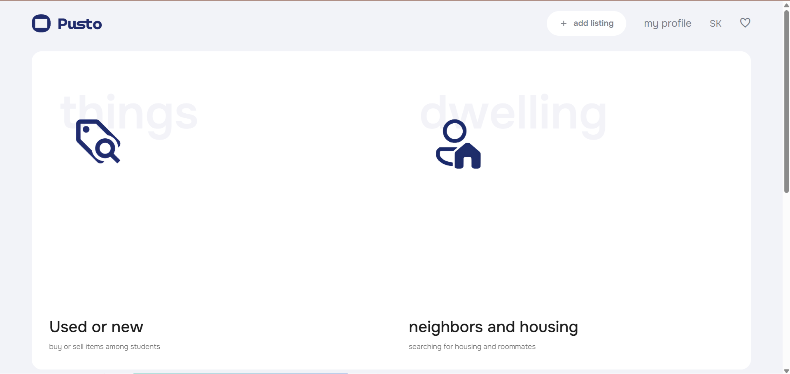
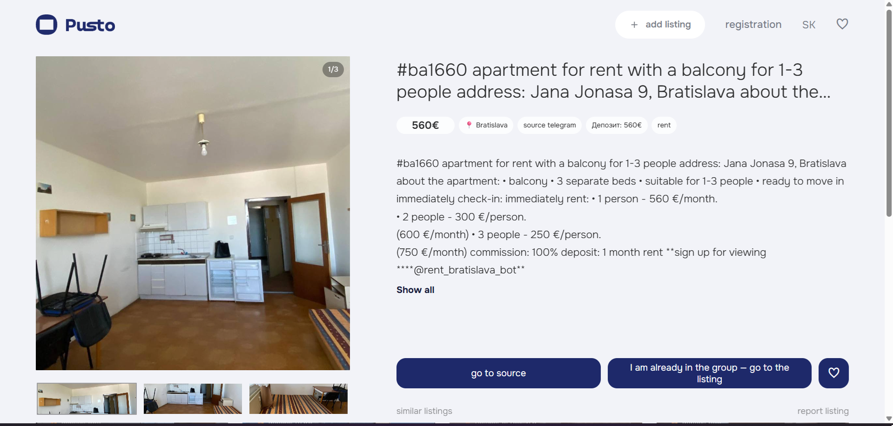
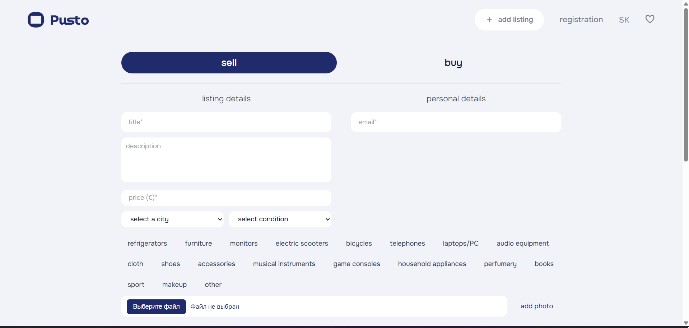
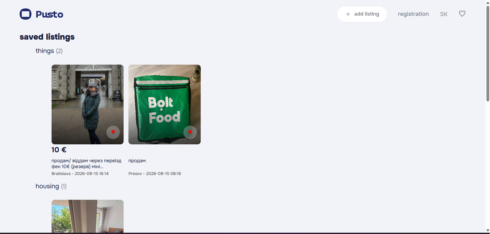
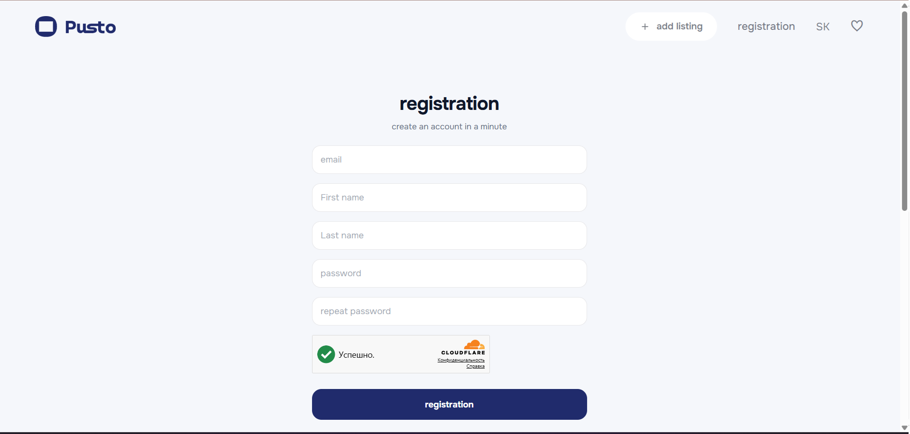
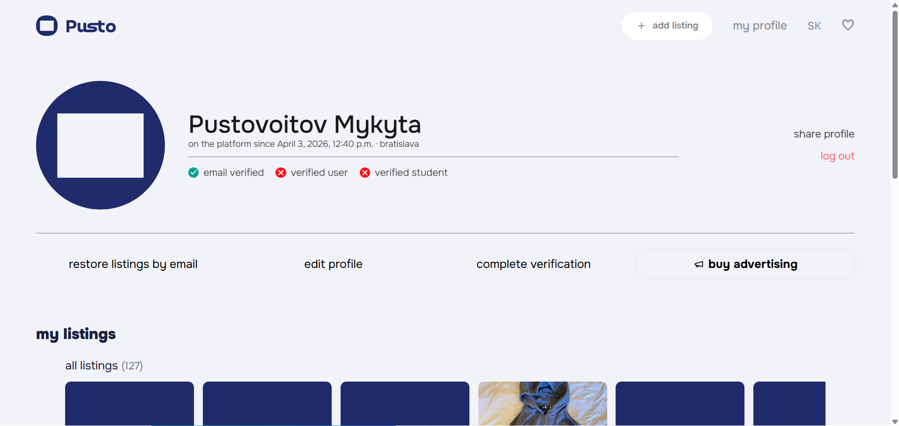

# Pusto.sk
https://pusto.sk/

**Pusto.sk** is a multilingual marketplace platform for students and Ukrainian communities in Slovakia. It aggregates listings from multiple sources into a single searchable platform, making it easier to find housing, neighbors, and second-hand items.

## 🚀 Features

- Multi-source listing aggregation
- Housing marketplace
- Buy & Sell marketplace
- Favorites system
- Advanced search and filtering
- Multilingual interface (English, Slovak, Ukrainian)
- Responsive design
- SEO optimization
- Admin moderation panel
- Dynamic categories and subcategories
- Contact forms
- Email notifications
- Premium advertisement promotion
- Banner advertisements
- Poster advertisements
- Featured listings
- Flexible advertisement duration
- Cryptocurrency payments
- Manual payment verification
- User-friendly interface

## 🛠 Tech Stack

- Python
- Django
- MySQL
- HTML5
- CSS3
- JavaScript
- Bootstrap
- Nginx
- Gunicorn
- Linux (Ubuntu)
- Cloudflare
- Stripe API
- Telegram Bot API
- Telethon

## ⚙️ Infrastructure

- Linux VPS deployment
- Gunicorn application server
- Nginx reverse proxy
- Cloudflare protection
- MySQL database
- Cron-based scheduled tasks
- Environment-based configuration (.env)
- Background automation services
- Media and static file management
- Search engine optimization (SEO)
- Multilingual architecture

## 🤖 Automation

- Aggregates listings from 10+ external platforms
- Parses Telegram channels and multiple marketplace sources
- Automatically publishes listings to the platform
- Translates every listing into three languages
- Downloads and processes listing images
- Detects and removes spam and irrelevant posts
- Classifies listings into categories and subcategories
- Extracts prices, locations, contact information, and other metadata
- Detects duplicate listings
- Continuously checks whether listings still exist on their original sources and automatically removes unavailable ones
- Runs scheduled background synchronization and processing tasks

## 💳 Monetization

- Premium advertisements
- Featured listing promotion
- Banner advertisements
- Poster advertisements
- Flexible advertisement duration
- Cryptocurrency payments
- Manual bank card payment verification by administrator

## 🌍 Languages

- English
- Slovak
- Ukrainian

## 📸 Screenshots

### Homepage

### Marketplace

### Profile&Other

## 👤 Author

Mykyta Pustovoitov
